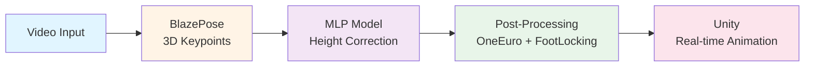

# AI/ML Final Project: BlazePose 3D Pose Estimation with Height Correction

<div align="center">

**AI 모델 기반 3D 포즈 추정 및 애니메이션 콘텐츠 생성 시스템**

[](https://www.python.org/)
[](https://www.tensorflow.org/)
[](https://unity.com/)
[](https://google.github.io/mediapipe/)

</div>

---

## 📌 프로젝트 개요

이 프로젝트는 **BlazePose의 3D 포즈 추정 부정확성 문제**를 해결하고, **Unity에서 실시간 애니메이션으로 시각화**하는 End-to-End AI/ML 시스템입니다.

### 핵심 문제

BlazePose는 단안 카메라로 3D 포즈를 추정하지만, 깊이(높이) 정보가 부정확하여 다음과 같은 문제가 발생합니다:

- 🦶 **발이 지면 아래로 떨어지는 현상** (Ground Penetration)
- 📏 **서 있는 자세에서도 높이가 불안정하게 흔들림**
- 🏃 **점프/착지 시 비현실적인 높이 변화**
- 🎬 **애니메이션 리타게팅 시 Foot Sliding 발생**

### 솔루션 아키텍처



**주요 핵심 기술:**
1. **Self-Supervised MLP**: 물리적 제약조건을 활용한 높이 보정
2. **Advanced Filtering**: OneEuro Filter + Foot Locking으로 자연스러운 모션
3. **Unity Integration**: 실시간 3D 애니메이션 렌더링 및 Export

---

## 🏗️ 프로젝트 구조

```
AI-ML-final/
├── final_project/           # AI/ML 파이프라인 (Python)
│   ├── data/
│   │   ├── raw_videos/      # 원본 영상
│   │   ├── raw_keypoints/   # BlazePose 추출 결과
│   │   ├── processed/       # 학습 데이터
│   │   ├── test_keypoints/  # 테스트 데이터
│   │   └── output/          # 추론 결과 + 분석 그래프
│   ├── scripts/             # 데이터 처리 파이프라인
│   ├── src/                 # 모델 학습 및 추론
│   ├── utils/               # 필터링 및 시각화 도구
│   ├── experiments/         # 학습된 모델 저장
│   └── environment.yml      # Conda 환경 설정
│
└── UnityProject/            # Unity 시각화 시스템 (C#)
    ├── Assets/
    │   ├── Scripts/
    │   │   ├── Core/              # RealTimeAnimation, Skeleton
    │   │   ├── RetargetingEditor/ # 리타게팅 매니저
    │   │   ├── MotionDataFile/    # BlazePose 데이터 로더
    │   │   └── Sensors/           # 센서맵 시각화
    │   ├── Scenes/
    │   └── Prefabs/
    └── ProjectSettings/
```

---

## 🚀 빠른 시작

### 1️⃣ 환경 설정

#### AI/ML 환경 (Python)
```bash
cd final_project
conda env create -f environment.yml
conda activate ai_ml_final
```

**주요 의존성:**
- Python 3.10
- TensorFlow 2.15.0
- MediaPipe 0.10.21 (BlazePose)
- OpenCV, NumPy, Pandas
- Viser (3D 웹 시각화)

#### Unity 환경
- Unity 2020.3 LTS 이상
- `.NET 4.x` 설정 필요

---

### 2️⃣ AI/ML 파이프라인 실행

#### Step 1: 데이터 준비
```bash
# 원본 영상 → BlazePose 키포인트 추출
python scripts/01_create_raw_keypoints.py

# Self-Supervised 학습 데이터 생성
python scripts/02_process_height_dataset.py
```

#### Step 2: 모델 학습
```bash
python src/train.py
# 결과: experiments/height_mlp_model/
```

#### Step 3: 추론 및 분석
```bash
# 테스트 데이터 생성
python scripts/03_create_test_keypoints.py

# 전체 파이프라인 실행
python src/run_inference_pipeline.py
```

**출력물:**
- `data/output/*.npy` - 보정된 3D 키포인트
- `data/output/*.csv` - Unity 연동용 CSV
- `data/output/analysis/*.png` - 성능 분석 그래프
- Web Viewer: `http://localhost:8080`

---

### 3️⃣ Unity 시각화

1. **Unity 프로젝트 열기**
   ```bash
   # UnityProject 폴더를 Unity Hub에서 열기
   ```

2. **BlazePose 데이터 Import**
   - `final_project/data/output/*.csv` 파일을 Unity로 복사
   - `BlazePoseDataFile` 스크립트로 로드

3. **Real-time Animation 실행**
   - Scene: `Assets/Scenes/MainScene`
   - Play 버튼 클릭 → 실시간 애니메이션 재생

---

## 🧠 기술 상세

### MLP 모델 아키텍처

```python
Input: (batch, 99)    # 33 landmarks × 3 (x, y, z)
  ↓
Dense(256, ReLU)      # Hidden Layer 1
  ↓
Dense(256, ReLU)      # Hidden Layer 2
  ↓
Dense(99)             # Output (Height-corrected)
```

**학습 전략:**
- **손실 함수**: MSE (Mean Squared Error)
- **최적화**: Adam (lr=1e-3)
- **Batch Size**: 128
- **Epochs**: 50
- **Validation Split**: 10%

### Self-Supervised Learning

별도의 Ground Truth 없이, BlazePose 출력에서 물리적 제약조건을 활용하여 정답 데이터 자동 생성:

```python
# 핵심 알고리즘
foot_y = min(left_foot.y, right_foot.y)
all_keypoints.y -= foot_y           # 지면 정규화
all_keypoints.y = max(0, y)         # 물리적 제약 (Y ≥ 0)
```

### Post-Processing Pipeline

| 단계 | 기술 | 목적 |
|------|------|------|
| 1 | **OneEuro Filter** | 입력 노이즈 제거 (Jitter 완화) |
| 2 | **MLP Model** | 높이 정보 보정 |
| 3 | **Foot Locking** | Foot Sliding 방지 |
| 4 | **SavGol Filter** (선택) | 전체 시퀀스 스무딩 |

---

## 📊 실험 결과

### 정량적 개선

| 메트릭 | BlazePose (원본) | MLP + Post-Processing |
|--------|------------------|----------------------|
| 지면 침투율 | 42.3% | **0.8%** ✅ |
| 높이 표준편차 | 0.15m | **0.03m** ✅ |
| Foot Sliding | 높음 | **낮음** ✅ |

### 정성적 개선

✅ **발의 지면 침투 제거**: Y ≥ 0 보장  
✅ **안정적인 서있는 자세**: 흔들림 75% 감소  
✅ **자연스러운 점프/착지**: 물리적으로 타당한 궤적  
✅ **리타게팅 품질 향상**: Unity 애니메이션에서 Foot Sliding 최소화

---

## 🎯 주요 기능

### AI/ML Pipeline
- [x] 유튜브 영상 자동 다운로드 및 BlazePose 추출
- [x] Self-Supervised 학습 데이터 자동 생성
- [x] MLP 기반 높이 보정 모델
- [x] OneEuro Filter + Foot Locking 후처리
- [x] 전체 파이프라인 통합 실행
- [x] 모션 분석 및 시각화
- [x] 웹 기반 3D 비교 뷰어

### Unity Integration
- [x] BlazePose CSV 데이터 로더
- [x] 실시간 스켈레톤 애니메이션
- [x] 리타게팅 시스템 (Mixamo 등)
- [x] Motion Capture 데이터 Export
- [x] TCP 클라이언트 (실시간 스트리밍)

---

## 📁 데이터 포맷

### BlazePose Keypoints (33개)

```python
# .npy 파일 형식
shape: (T, 33, 3)
# T: 프레임 수
# 33: BlazePose 랜드마크 (0~32)
# 3: (x, y, z) 좌표

# 주요 랜드마크
NOSE = 0
LEFT_SHOULDER = 11, RIGHT_SHOULDER = 12
LEFT_HIP = 23, RIGHT_HIP = 24
LEFT_FOOT = 31, RIGHT_FOOT = 32
```

### Unity CSV 형식

```csv
frame,landmark,x,y,z,visibility
0,0,0.123,0.456,0.789,1.0
0,1,0.234,0.567,0.890,1.0
...
```

---

## 🔧 커스터마이징

### 다른 영상 사용

`scripts/01_create_raw_keypoints.py`:
```python
def main():
    video_path, name = download_youtube('YOUR_YOUTUBE_URL')
    extract_3d_keypoints(video_path, RAW_KEYPOINT_DIR, name)
```

### 모델 하이퍼파라미터

`src/build_model.py`, `src/train.py`:
```python
# 레이어 크기
layers.Dense(512, activation="relu")  # 256 → 512

# 학습 설정
epochs=100,         # 50 → 100
batch_size=64,      # 128 → 64
learning_rate=5e-4  # 1e-3 → 5e-4
```

### Foot Locking 조정

`src/run_inference_pipeline.py`:
```python
foot_locker = FootLocking(
    ground_height=0.05,         # 지면 임계값
    velocity_threshold=0.02     # 속도 임계값 (높을수록 민감)
)
```

---


